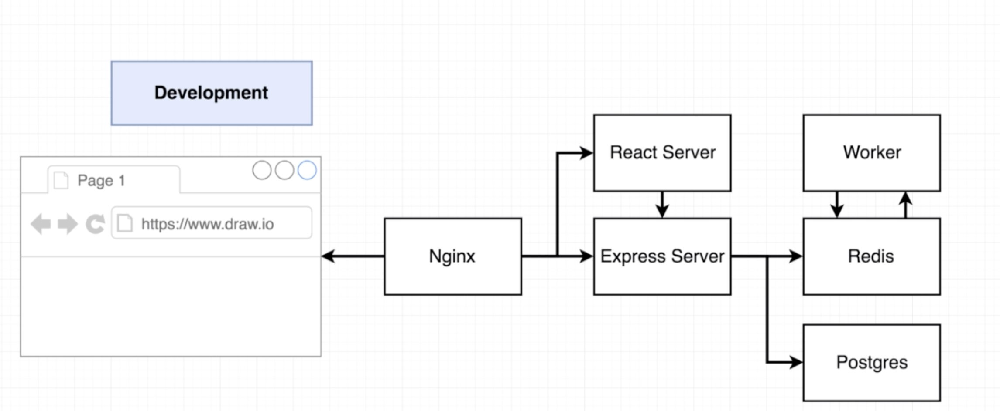
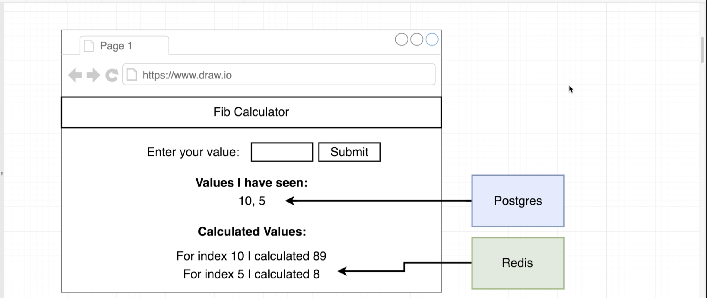
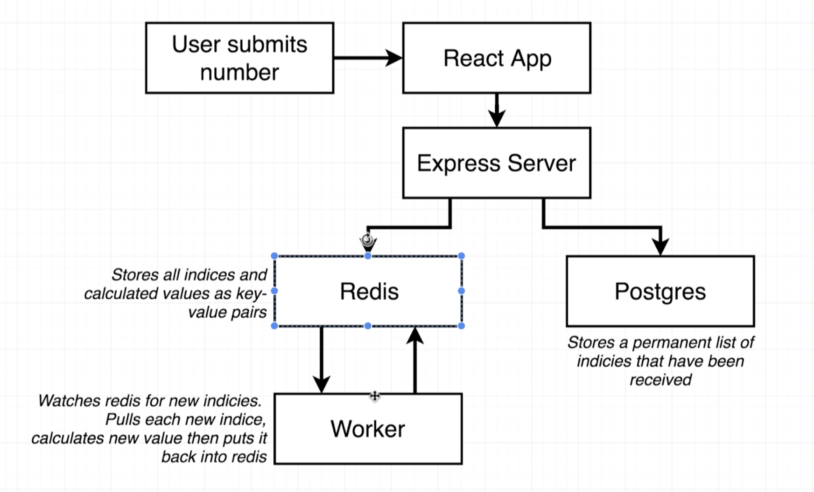

# Docker training series:

### Main Idea

This repository represents an over-complicated fibonacci calculator that is focused on docker containers and CI/CD

Technologies: Docker, AWS, TravisCI, React, Node, PostgreSQL

### Architecture

#### Main components

#### Storage and UI

#### Flow Diagram

